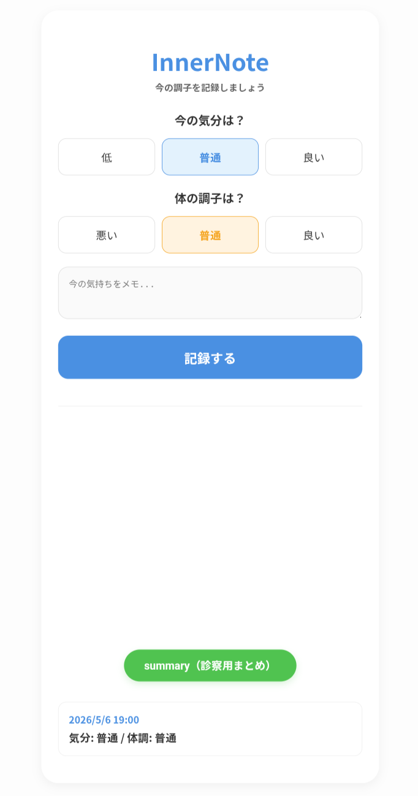
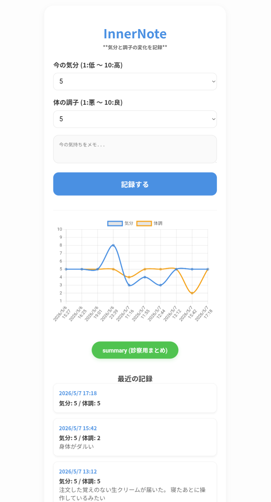

## Hi, I'm Bipolar-cat 🐱🐾
当事者の視点で、生活を助けるシステムを作っています。

### プロジェクト名 (気分と調子の変化を記録)して生活を可視化する。

精神疾患の診察は時間が限られており、体調が悪いときほど自分の状態を正確に伝えるのが難しくなります。私自身の当事者としての経験から、日々の記録を自動で整理し、可視化することで自身の状態を把握することができ、医師にそのまま見せられる形にまとめるツールを開発しました。

また、「step3」「step10」を作ったのは個人によって使いやすさが違うようで、使用しやすいツールを使用してほしいと思い2種類を作りました。

### 🏃‍♂️ 精神障害者だけでなく健常者など誰でも日々の変化を生活に活かせるように使用してほしいです。

### ✨ 主な機能

* **自動要約機能**: 日々の記録を「step3」や「step10」の形式で分かりやすく整理します。
* **診察用メモの作成**: 医師に伝えるべき優先事項を抽出します。
* **シンプル操作**: 負担を感じず、日常的に使い続けられる設計を目指しています。

## ツール一覧
- [基本の記録 (base)](./base/index.html)
- [サマリー付き記録 (summary)](./summary/index.html)

### 🚀 使い方

* URLをタップし、その日の気分や活動を入力します。
* 「summary(診察用まとめ)」を押すと、診察に最適なフォーマットで出力されます。
* 出力された内容を、診察時に医師へ提示または共有してください。
---

### 🐱 About Me
* 🔭 **I’m currently working on**: 心と体の記録ツール「InnerNote」を開発しています。
* 🌱 **I’m currently learning**: HTML5, CSS3, JavaScript, React, GitHub, Render
* 👯 **I’m looking to collaborate on**:
* 🤔 **I’m looking for help whis**: 
* 💬 **Ask me about**:
* 📫 **How to reach me**: 1102.okappi73@gmail.com
* ✨️ **fun fact**:Two cats🐱, Fuku and Hime, and a Baumkuchen
　
